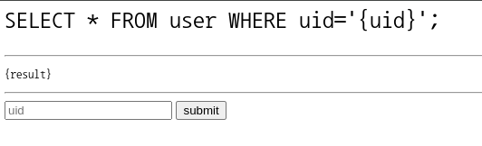
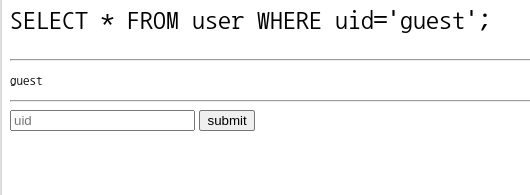
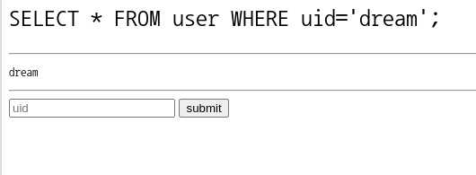
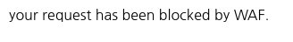
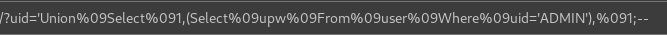

# sql injection on bypass WAF

- **Category** : Web
- **Level** : 1

    [sql injection on bypass WAF](https://dreamhack.io/wargame/challenges/415)

## 문제 설명
- 이 문제는 SQL Injection 취약점이 존재하는 웹 애플리케이션을 대상으로 한다

- **WAF (Web Application Firewall)** 가 적용되어 있어, 일반적인 SQL Injection이 차단되어 있다.

- 이번 문제에서는 WAF를 우회하여 SQL Injection을 발생시켜 플래그를 획득하는 것을 목표로 한다


## 해설

### 코드 해석

#### **app.py**

```python
import os
from flask import Flask, request
from flask_mysqldb import MySQL

app = Flask(__name__)
app.config['MYSQL_HOST'] = os.environ.get('MYSQL_HOST', 'localhost')
app.config['MYSQL_USER'] = os.environ.get('MYSQL_USER', 'user')
app.config['MYSQL_PASSWORD'] = os.environ.get('MYSQL_PASSWORD', 'pass')
app.config['MYSQL_DB'] = os.environ.get('MYSQL_DB', 'users')
mysql = MySQL(app)

template ='''
<pre style="font-size:200%">SELECT * FROM user WHERE uid='{uid}';</pre><hr/>
<pre>{result}</pre><hr/>
<form>
    <input tyupe='text' name='uid' placeholder='uid'>
    <input type='submit' value='submit'>
</form>
'''

keywords = ['union', 'select', 'from', 'and', 'or', 'admin', ' ', '*', '/']
def check_WAF(data):
    for keyword in keywords:
        if keyword in data:
            return True

    return False


@app.route('/', methods=['POST', 'GET'])
def index():
    uid = request.args.get('uid')
    if uid:
        if check_WAF(uid):
            return 'your request has been blocked by WAF.'
        cur = mysql.connection.cursor()
        cur.execute(f"SELECT * FROM user WHERE uid='{uid}';")
        result = cur.fetchone()
        if result:
            return template.format(uid=uid, result=result[1])
        else:
            return template.format(uid=uid, result='')

    else:
        return template


if __name__ == '__main__':
    app.run(host='0.0.0.0')
```

1. WAF 필터링

    ```python
    keywords = ['union', 'select', 'from', 'and', 'or', 'admin', ' ', '*', '/']
    ```

   * 사용자 입력에 위 키워드가 포함되면 True값을 반환하여 요청이 차단된다

2. SQL Query

    ```sql
    SELECT * FROM user WHERE uid='{uid}';
    ```

    * 입력 값은 위 쿼리에 직접 삽입되어 SQL Injection 취약점이 발생한다

3. 결과 출력

    ```python
    result = cur.fetchone()
        if result:
            return template.format(uid=uid, result=result[1])
        else:
            return template.format(uid=uid, result='')
    ```

    * 쿼리 결과의 두 번째 값(result[1])이 HTML 템플릿에 표시된다

    * 결과 값이 없다면 아무것도 출력하지 않는다

#### **init.sql**

```sql
CREATE DATABASE IF NOT EXISTS `users`;
GRANT ALL PRIVILEGES ON users.* TO 'dbuser'@'localhost' IDENTIFIED BY 'dbpass';

USE `users`;
CREATE TABLE user(
  idx int auto_increment primary key,
  uid varchar(128) not null,
  upw varchar(128) not null
);

INSERT INTO user(uid, upw) values('abcde', '12345');
INSERT INTO user(uid, upw) values('admin', 'DH{**FLAG**}');
INSERT INTO user(uid, upw) values('guest', 'guest');
INSERT INTO user(uid, upw) values('test', 'test');
INSERT INTO user(uid, upw) values('dream', 'hack');
FLUSH PRIVILEGES;
```

1. db 형태
   
   코드를 분석해보면 DB의 형태는 `user`테이블에 `idx`, `uid`, `upw`라는 컬럼이 존재하며 각 컬럼의 값은 다음과 같다

   **user**
   | idx |  uid  |      upw     |
   |-----|-------|--------------|
   |  0  | abcde |     12345    |
   |  1  | admin | DH{**FLAG**} |
   |  2  | guest |     guest    |
   |  3  | test  |     test     |
   |  4  | dream |     hack     |

### 실습

문제 화면



uid에 값을 입력하면 결과값이 출력되는 구조이다

uid에 `guest`값을 넣으면



`guest`가 출력된다

이번엔 uid에 `dream`을 넣어보자



DB를 보면 `hack`이 나올 것 같았지만 `dream`이 나온다

이유는 `result`가 출력될때 결과 값의 두 번쩨를 출력해주는데 결과 값의 리스트는 [idx, uid, upw]이기 때문에 두 번째 값인 uid가 출력된다

#### 취약점 분석

1. 필터링 우회
   
   - 명령어
     - 코드를 보면 소문자만 필터링 되고있기 때문에 대문자로 입력시 필터링되지 않는다

     - EX. `Union`, `UNION`

   - 공백
     - 공백은 주석으로 우회할 수 있지만 주석 기호가 필터링 된다

     - 공백이나, 주석 대신 tab으로 우회가 가능하다

2. 페이로드
   
   위에서 설명한 우회 방법으로 페이로드를 짜보면 다음과 같다

   ```sql
   'Union    Select  1,   (Select    upw From    user    Where   uid='ADMIN'),   1;--
   ```

   - 공백 대신 `tab` 사용
  
   - 명령어에 대문자를 섞어 사용
  
   - 이전 select 문에서 **3**개 컬럼을 반환하므로 union 연산도 3개 값 반환
  
   - `result`에서 두 번째 값을 출력하므로 두 번째 값에 원하는 결과 값을 **select**

   - 입력값 뒤에 오는 것들을 `--`으로 주석처리

3. 실행 결과

    

    실행을 해보면 WAF에 의해 차단되었다고 한다

    이유는 HTML의 입력란에 페이로드를 넣으면 tab을 단순 공백으로 인식하기 때문이다

    그래서 tab을 url인코딩을 하여 url에 직접 넣어줘야 한다

    ##### url인코딩한 페이로드:
    ```url
    'Union%09Select%091,(Select%09upw%09From%09user%09Where%09uid='ADMIN'),%091;--
    ```

    - `tab`을 url인코딩 하면 %09

    - 나머지 기호들은 url에 넣어주면 자동으로 인코딩 된다

    인코딩한 결과로 url에 직접 넣어주면

    

    플래그가 출력되는걸 확인할 수 있다