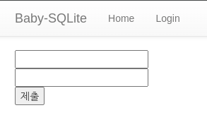
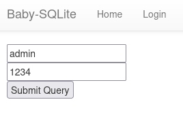
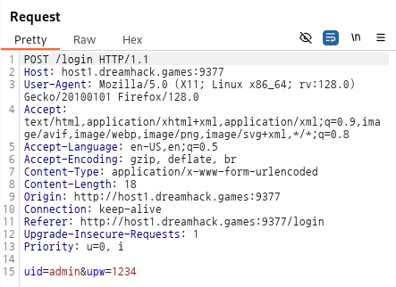

# baby-sqlite

- **Category** : Web
- **Level** : 2

    [sql injection on bypass WAF](https://dreamhack.io/wargame/challenges/1)

## 문제 설명

- 웹에서 SQL Injection 취약점을 이용해 플래그를 획득하는 문제이다

- 웹 페이지에 로그인 기능이 구현되어 있다

## 해설

### 코드 분석


```python
sqli_filter = ['[', ']', ',', 'admin', 'select', '\'', '"', '\t', '\n', '\r', '\x08', '\x09', '\x00', '\x0b', '\x0d', ' ']
```

  - 특수문자, 공백, 단어 등을 필터링하고 있음

```python
query = f"SELECT uid FROM users WHERE uid='{uid}' and upw='{upw}' and level={level};"
```

  - DB에서 실행될 쿼리 구조

```python
uid = request.form.get('uid', '').lower()
upw = request.form.get('upw', '').lower()
level = request.form.get('level', '9').lower()
```

  - 각 필드를 소문자로 변환하여 대소문자를 구분하지 않음을 명시

  - 각 필드의 기본값을 정의하고 있음

    - uid, upw는 빈 문자열 `''`

    - level은 문자열 `'9'`

### 페이지 분석



로그인 기능이 구현되어있는 페이지다

어떤식으로 서버에 전송되는지 확인하기 위해 `Burpsuit`를 통해 알아보자



우선 아무값을 넣어서 확인을 해보았다



```
uid=admin&upw=1234
```
이렇게 넘어가는 것을 확인할 수 있다

level은 보이지 않는데 코드에서 확인했듯이 `level`은 기본값으로 `9`를 정하고 있었다

우리는 이 `level`을 통해 SQL Injection 취약점을 이용할것이다

